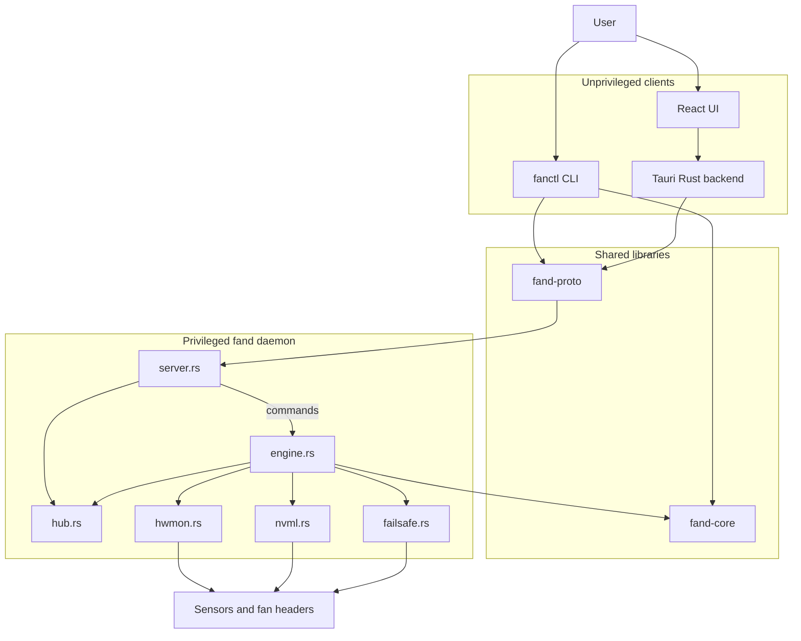
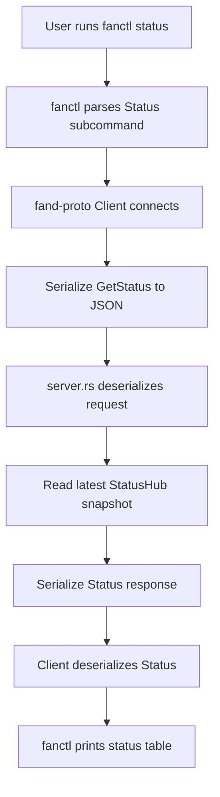
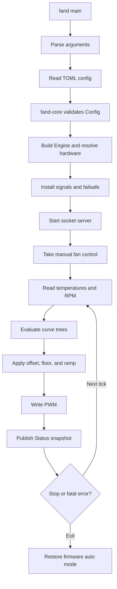
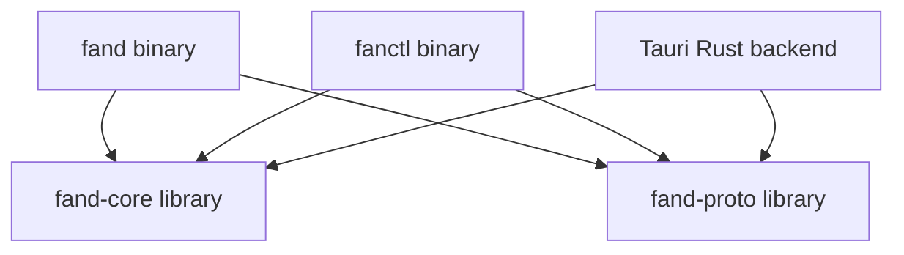
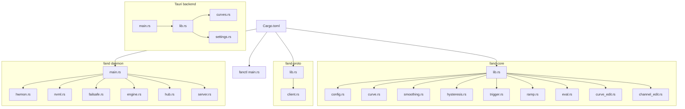

# fand flow diagrams

## Runtime architecture

```mermaid
flowchart TD
    USER[User]

    subgraph CLIENTS[Unprivileged clients]
        CLI[fanctl CLI]
        UI[React UI]
        TAURI[Tauri Rust backend]
        UI --> TAURI
    end

    subgraph SHARED[Shared libraries]
        PROTO[fand-proto]
        CORE[fand-core]
    end

    subgraph DAEMON[Privileged fand daemon]
        SERVER[server.rs]
        HUB[hub.rs]
        ENGINE[engine.rs]
        HWMON[hwmon.rs]
        NVML[nvml.rs]
        SAFE[failsafe.rs]
    end

    HARDWARE[Sensors and fan headers]

    USER --> CLI
    USER --> UI
    CLI --> PROTO
    CLI --> CORE
    TAURI --> PROTO
    PROTO --> SERVER
    SERVER --> HUB
    SERVER -->|commands| ENGINE
    ENGINE --> CORE
    ENGINE --> HWMON
    ENGINE --> NVML
    ENGINE --> HUB
    ENGINE --> SAFE
    HWMON --> HARDWARE
    NVML --> HARDWARE
    SAFE --> HARDWARE
```

## `fanctl status` flow

```mermaid
flowchart TD
    A[User runs fanctl status]
    B[fanctl parses Status subcommand]
    C[fand-proto Client connects]
    D[Serialize GetStatus to JSON]
    E[server.rs deserializes request]
    F[Read latest StatusHub snapshot]
    G[Serialize Status response]
    H[Client deserializes Status]
    I[fanctl prints status table]

    A --> B --> C --> D --> E --> F --> G --> H --> I
```

## Daemon startup and control loop

```mermaid
flowchart TD
    A[fand main]
    B[Parse arguments]
    C[Read TOML config]
    D[fand-core validates Config]
    E[Build Engine and resolve hardware]
    F[Install signals and failsafe]
    G[Start socket server]
    H[Take manual fan control]
    I[Read temperatures and RPM]
    J[Evaluate curve trees]
    K[Apply offset, floor, and ramp]
    L[Write PWM]
    M[Publish Status snapshot]
    N{Stop or fatal error?}
    O[Restore firmware auto mode]

    A --> B --> C --> D --> E --> F --> G --> H --> I
    I --> J --> K --> L --> M --> N
    N -->|Next tick| I
    N -->|Exit| O
```

## Rust crate dependencies

```mermaid
flowchart TD
    CORE[fand-core library]
    PROTO[fand-proto library]
    DAEMON[fand binary]
    CLI[fanctl binary]
    GUI[Tauri Rust backend]

    DAEMON --> CORE
    DAEMON --> PROTO
    CLI --> CORE
    CLI --> PROTO
    GUI --> CORE
    GUI --> PROTO
```

## Rust file map

```mermaid
flowchart TD
    ROOT[Cargo.toml]

    subgraph CORE[fand-core]
        CLIB[lib.rs]
        CONFIG[config.rs]
        CURVE[curve.rs]
        SMOOTH[smoothing.rs]
        HYST[hysteresis.rs]
        TRIGGER[trigger.rs]
        RAMP[ramp.rs]
        EVAL[eval.rs]
        CEDIT[curve_edit.rs]
        CHEDIT[channel_edit.rs]
    end

    subgraph PROTO[fand-proto]
        PLIB[lib.rs]
        CLIENT[client.rs]
    end

    subgraph FAND[fand daemon]
        MAIN[main.rs]
        HWMON[hwmon.rs]
        NVML[nvml.rs]
        SAFE[failsafe.rs]
        ENGINE[engine.rs]
        HUB[hub.rs]
        SERVER[server.rs]
    end

    FANCTL[fanctl main.rs]

    subgraph GUI[Tauri backend]
        GMAIN[main.rs]
        GLIB[lib.rs]
        GCURVES[curves.rs]
        SETTINGS[settings.rs]
    end

    ROOT --> CLIB
    ROOT --> PLIB
    ROOT --> MAIN
    ROOT --> FANCTL
    CLIB --> CONFIG
    CLIB --> CURVE
    CLIB --> SMOOTH
    CLIB --> HYST
    CLIB --> TRIGGER
    CLIB --> RAMP
    CLIB --> EVAL
    CLIB --> CEDIT
    CLIB --> CHEDIT
    PLIB --> CLIENT
    MAIN --> HWMON
    MAIN --> NVML
    MAIN --> SAFE
    MAIN --> ENGINE
    MAIN --> HUB
    MAIN --> SERVER
    GMAIN --> GLIB
    GLIB --> GCURVES
    GLIB --> SETTINGS
```
